# DefenderDeviceControlUnmanaged

[](https://www.powershellgallery.com/packages/DefenderDeviceControlUnmanaged)
[](LICENSE)
[](https://lukeevanstech.github.io/defender-device-control-unmanaged/)

> Microsoft Defender Device Control for **unmanaged** Windows 11 devices - no Intune, no domain GPO, no MDM. Just a PowerShell module you install.

Microsoft's own documentation for Defender Device Control assumes you deploy via Intune CSP, domain GPO (GPMC), or Configuration Manager. The canonical local GPO registry surface - what GPMC would push under the hood - is buried in `WindowsDefender.admx` and never explained as a deployable path. **This module is that path:** one cmdlet, MDE-onboarded box, policy applied.



## 60-second install

```powershell
Install-Module DefenderDeviceControlUnmanaged -Scope CurrentUser
Set-DefenderDcPolicy -Mode Audit
Test-DefenderDcPolicy -ExpectMode Audit
```

## Documentation

Full docs: **<https://lukeevanstech.github.io/defender-device-control-unmanaged/>**

- [Why this module exists](https://lukeevanstech.github.io/defender-device-control-unmanaged/why/)
- [Quickstart](https://lukeevanstech.github.io/defender-device-control-unmanaged/quickstart/install/)
- [Extending device categories](https://lukeevanstech.github.io/defender-device-control-unmanaged/howto/extend-device-categories/)
- [Cmdlet reference](https://lukeevanstech.github.io/defender-device-control-unmanaged/reference/cmdlets/Set-DefenderDcPolicy/)

## Cmdlets

| Cmdlet | Purpose |
|---|---|
| `Set-DefenderDcPolicy` | Apply or remove the policy (Audit / Enforce / Off) |
| `Get-DefenderDcPolicy` | Read current state as an object |
| `Test-DefenderDcPolicy` | Verify deployed state (PASS/FAIL per check) |
| `Test-DefenderDcPolicyXml` | Validate a custom XML before deploy |
| `Invoke-DefenderDcOnboarding` | Wrap the per-tenant MDE local-onboarding script |
| `Invoke-DefenderDcUsbTest` | End-to-end USB test with transcript |

## Requirements

- Windows 11 (or Windows 10) Enterprise
- PowerShell 5.1 or 7.x
- Microsoft Defender for Endpoint attach (Plan 1, Plan 2, or Defender for Business)
- Local administrator for the apply step

## License

[MIT](LICENSE)
