# Registry surface

Defender Device Control is a registry-driven feature. Whether you
configure it through Intune CSP, domain GPO, or this module, the
Defender engine ultimately reads from the same set of registry values
under `HKLM:\SOFTWARE\Policies\Microsoft\Windows Defender\`. This
module writes those values directly -- the same values GPMC would push
under the hood -- without requiring any management infrastructure.

## The five values

All five values live under one parent key:

`HKLM:\SOFTWARE\Policies\Microsoft\Windows Defender\`

| Subkey | Value name | Type | Value |
|--------|------------|------|-------|
| `Features` | `DeviceControlEnabled` | REG_DWORD | `1` |
| `Device Control` | `DefaultEnforcement` | REG_DWORD | `1` (Allow) |
| `Device Control` | `SecuredDevicesConfiguration` | REG_SZ | `RemovableMediaDevices|CdRomDevices|WpdDevices` |
| `Device Control\Policy Groups` | `PolicyGroups` | REG_SZ | Absolute path to `PolicyGroups.xml` |
| `Device Control\Policy Rules` | `PolicyRules` | REG_SZ | Absolute path to `PolicyRules.<Mode>.xml` |

`DefaultEnforcement=1` means Allow by default -- devices not matched by
any group/rule entry are permitted. `SecuredDevicesConfiguration` lists
the device classes the engine monitors; the three values shown cover
removable disks (USB sticks), optical media (CD/DVD), and Windows
Portable Devices (cameras, phones via MTP).

## Why DeviceControlEnabled is written last

The five values are not written in any arbitrary order. `Features\DeviceControlEnabled`
is always written as the final step. The reasoning is an auto-rollback
guarantee: if any of the earlier writes fails mid-sequence (for example,
due to a permissions error or a malformed path), the master toggle is
never flipped. The Defender engine never sees a half-configured policy
surface, which means it cannot enter an indeterminate state where it
thinks DC is active but the rules files are missing or unreadable.

If the module encounters an error during the write sequence, it
catches the failure, removes all values it has already written (a full
rollback of the policy subtree), and re-throws the error. The machine
is left in its original state.

## The XML files registered by the string values

`PolicyGroups` and `PolicyRules` are REG_SZ values that contain absolute
filesystem paths. The Defender engine reads these paths at policy load
time and parses the XML files directly.

`PolicyGroups.xml` defines the device classes and identifiers being
targeted -- it groups devices by class GUID, device ID, or other
properties. `PolicyRules.Audit.xml` and `PolicyRules.Enforce.xml` define
the enforcement entries: what action to take (`AuditAllowed` or `Deny`)
and which access masks to apply (write, execute, or both) when a device
in a listed group is accessed.

For the format requirements those XML files must satisfy, see
[Policy XML format](policy-xml-format.md).
