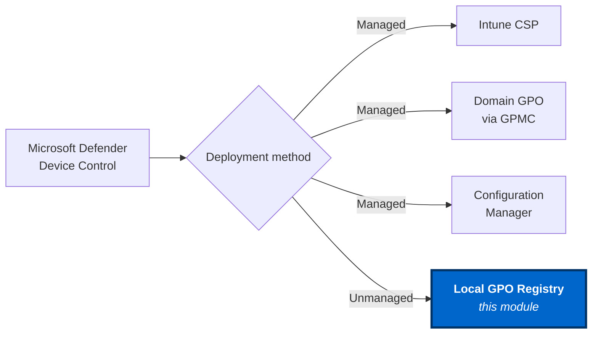

# DefenderDeviceControlUnmanaged

> Microsoft Defender Device Control for **unmanaged** Windows 11 devices - no Intune, no domain GPO, no MDM. Just a PowerShell module you install.



Microsoft's own documentation for Defender Device Control assumes you deploy via Intune CSP, domain GPO (GPMC), or Configuration Manager. The canonical local GPO registry surface - what GPMC would push under the hood - is buried in `WindowsDefender.admx` and never explained as a deployable path. **Unmanaged Windows 11 devices are out in the cold even when they're MDE-licensed.** This module is that deployable path.

## 60-second install

```powershell
Install-Module DefenderDeviceControlUnmanaged -Scope CurrentUser
Set-DefenderDcPolicy -Mode Audit         # log without block
Test-DefenderDcPolicy -ExpectMode Audit
```

When you're confident in audit, flip to enforce:

```powershell
Set-DefenderDcPolicy -Mode Enforce
```

## What it does

- **Read:** allowed on USB / WPD / optical.
- **Write:** denied (in Enforce) or logged (in Audit) on the same classes.
- **Execute-from-device:** denied on the same classes.

## What it does not do

See [Scope](concepts/scope.md). High-level: not a fleet rollout tool, requires MDE attach, no per-user carve-outs in v1.

## Next steps

- [Quickstart](quickstart/install.md)
- [Why this module exists](why.md)
- [Extend to your own device categories](howto/extend-device-categories.md)
